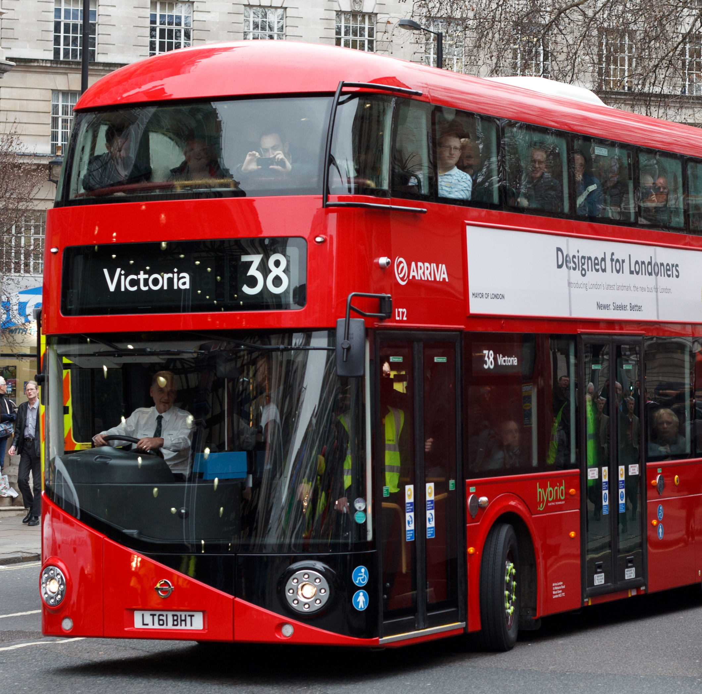
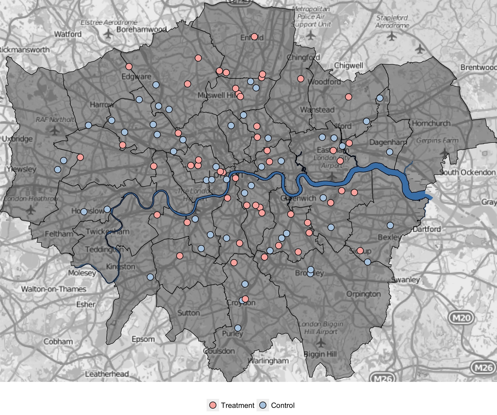
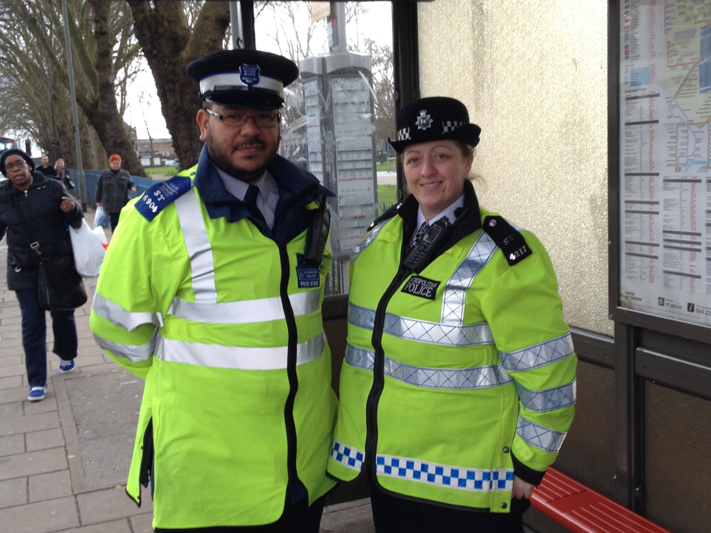

---
output:
  revealjs::revealjs_presentation:
    transition: slide
    css: styles.css
---

```{r setup, include=FALSE}
library(dplyr) ; library(highcharter)

df <- read.csv("bus_crime.csv", header = T) %>% 
  mutate(month = as.Date(month, format = "%Y-%m-%d"))
```


<section class="center" data-background="#93c572">
<h1 style="color:white;">Operation Menas</h1>
<h2 style="color:white;">A hotspots policing RCT on <br>London's bus network</br></h2>
<br></br>
<b>Henry Partridge</b>
</section>

# Background

## London's bus network

<div style="float: left; width:60%;">

</div>

<div style="float: right; width: 40%;">
&nbsp;

- 680 bus routes
- 19,500 bus stops
- 7,500 buses 
- 6 million passengers each weekday
</div>

## Bus-related crime and disorder

```{r, echo=FALSE}
highchart() %>% 
  hc_title(text = "") %>% 
  hc_add_series_times_values(df$month, df$rate,
                             name = "Rate", color = "#FFFF00") %>% 
  hc_yAxis(title = list(text = "Crimes per million passenger journeys")) %>% 
  hc_tooltip(valueDecimals = 1) %>% hc_legend(enabled = FALSE) %>% 
  hc_credits(enabled = TRUE, text = "Data: Transport for London",
             href = "https://tfl.gov.uk/corporate/publications-and-reports/crime-and-incident-bulletins",
             style = list(fontSize = "10px"))
```

# What is known about the effectiveness of hotspots policing on bus-related crime?

## Bus-related crime

- High crime bus routes pass through high crime areas 
<small>(Pearlstein & Wachs 1982; Newton 2008)</small>
- Bus stops are crime generators    
<small>(Roman 2005; Weisburd et al. 2012)</small>
- Crime is concentrated at a small number of bus stops 
<small>(Loukaitou-Sideris 1999; Newton & Bowers 2007)</small>
    + 0.05% (N=10) of bus stops in Los Angeles accounted for 18% of bus stop crime 
    + 20% of all shelter damage in the Wirral occurred at 2.5% of all shelters 
- Crime is more common at bus stops than on board buses    
<small>(Levine 1986)</small>

## HSP on public transport

- Hot spots policing is an effective crime prevention strategy    
<small>(Braga et al. 2012)</small>
- 15 minutes is the optimal duration for police presence at hot spots    
<small>(Koper 1995)</small>
- Operation Beck
    + assessed the effect of police presence at ‘hot’ London Underground platforms   
    + recorded a 20% reduction in calls-for service at the treatment platforms compared with the control platforms    
<small>(Ariel & Sherman 2014)</small>

# Evaluation design

## Maryland SMS
&nbsp;

Standard                          Description
---------------------             ---------------------
*Level 1:*                          Correlation between a crime prevention program and a measure of crime or crime risk factors at a single point in time.
*Level 2:*                          Temporal sequence between the program and the crime or risk outcome clearly observed, or the presence of a comparison group without demonstrated comparability to the treatment group.
*Level 3:*                          A comparison between two or more comparable units of analysis, one with and one without the program.
*Level 4:*                          Comparison between multiple units with and without the program, controlling for other factors, or using comparison units that evidence only minor differences.
*Level 5:*                          Random assignment and analysis of comparable units to program and comparison groups.

<small>(Sherman et al., 1997; Farrington, 2002)</small>

## Hypothesis
&nbsp;

<blockquote>
"Directed police patrols at high crime bus stops between 12-1900 hours will reduce crime levels compared to bus stops with no police presence." </blockquote>

## Mechanism
&nbsp;

The presence of police officers will increase the perceived risk of apprehension and therefore reduce offending.

## Pre-test and outcome measures
&nbsp;

Measure                           Description
---------------------             ---------------------
*Driver Incident Reports*         Calls made by bus drivers to CentreComm, the London Buses control room, who determine whether an emergency response is required  
*Bus-related CRIS*                A subset of Metropolitan Police recorded crime extracted using a keyword search

## Unit of analysis
<div style="float: left; width:60%;">

</div>

<div style="float: right; width: 40%;">
&nbsp;

* Bus stops    
     + 50m, 100m and 150m buffers
     + Contiguous bus route runs
</div>

## Eligibility for randomisation
&nbsp;

1. Bus stops must not be spatially auto-correlated. K nearest Local Indicators of Spatial Association (LISA) were used (K = 2); 
2. The coefficient of variation (CoV) must be less than or equal to 0.5 (Johnson et al. 2008). A CoV close to zero indicates a temporally stable pattern of DIRs between 2012 and 2013;
3. Police assistance must have been required in at least a third of the DIRs at each bus stop.

## Statistical power
&nbsp;

A prospective power analysis was conducted to determine an adequate sample size for the study.
Given a sample size of 102, an alpha level of .05 and a medium effect size (d = 0.5), the estimated power was 0.80.

## Random allocation

<div style="float: left; width:60%;">

</div>

<div style="float: right; width: 40%;">

- 102 bus stops across London were randomly assigned to Treatment and Control conditions based on the volume of DIRs over a 6 month period during 2013    
- Assignment was conducted within 3 statistical blocks (high, medium and low) with discrete levels of DIRs
</div>

## Risks to internal validity
&nbsp;

Risk                              Mitigation
---------------------             ---------------------
*Non-equivalence between groups*  Ran baseline comparisons (t-tests)  
*Attrition*                       Pair would be swapped out
*Contamination*                   Conducted tests for presence of spatial autocorrelation
                                  Senior police officers were not advised of the location of control sites

# Implementation

## Delivery (Feb-Jul 2013)

<div style="float: left; width:50%;">

- Intervention delivered by pairs of PCs and PCSOs 
- 3 x 15-minute patrols, Monday-Friday 12-1900 hours at treatment sites with on board patrols along contiguous bus route runs
- Each pair accountable for 2–4 hotspots
- "Business as usual" at the control sites
- Duration: 6 months
</div>

<div style="float: right; width: 50%;">

</div>

## Monitoring and support

<div style="float: left; width:80%;">

- All officers involved particpated in a one-day training course
- Coordinated by 1 Inspector and 2 sergeants
- Detailed patrol patterns
- Weekly briefings
- GPS devices indicated how much time officers spent at each hotspot
</div>

## Challenges

<div style="float: left; width:80%;">

- Time and distance
- Officer engagement
- SMT support
- GPS devices
</div>

## Post-test
&nbsp;

Used adjusted Poisson-regression models to compare differences in pre- and post-treatment measures of outcomes and estimated-marginal-means.

&nbsp;

Buffer size	           DIRs (% change)	      Crimes (% change)
---------------------  ---------------------  ---------------------
0-50m	                 -37	                  25
50-100m	               -40 	                  23
100-150m	             -10	                  7

## Conclusions
&nbsp;

Hotspots policing at bus stops - and potentially other “micro places” - has a limited deterrent effect if patrol patterns are predictable. Police agencies therefore need to randomise their deployments both spatially and temporally to increase the unpredictability of enforcement.

## Weaknesses of design
&nbsp;

- "Randomised studies may not allow investigators the freedom to carefully explore how treatments or programs influenced their intended subjects"    
<small>(Weisburd et al., 2001: 66)</small>
- Lacked offender-level survey data

## Further reading

Ariel, B., & Partridge, H. (2016). [Predictable Policing: Measuring the Crime Control Benefits of Hotspots Policing at Bus Stops.](http://link.springer.com/article/10.1007/s10940-016-9312-y) *Journal of Quantitative Criminology.*

# Questions?
